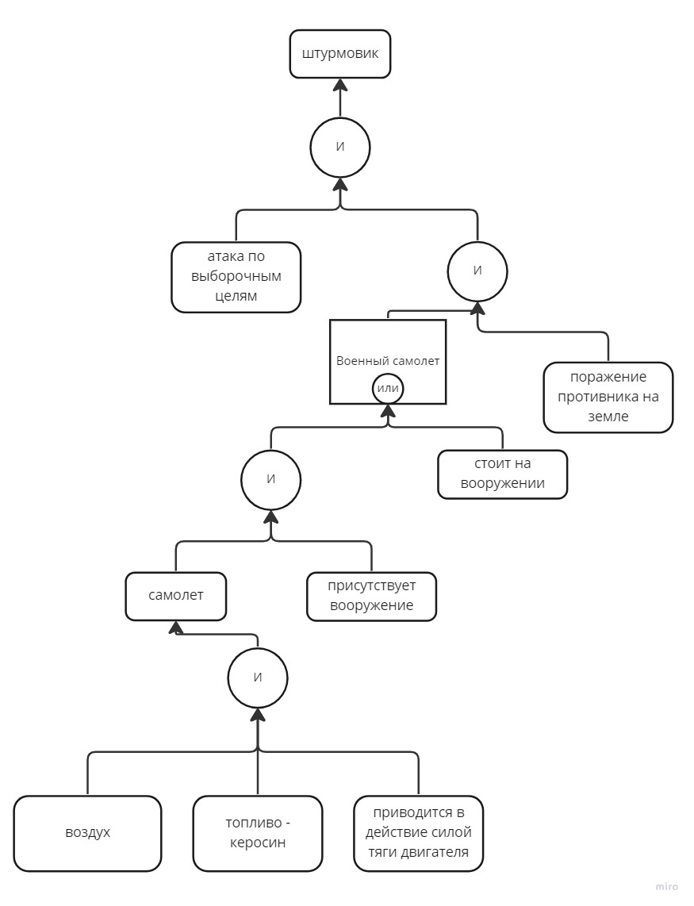
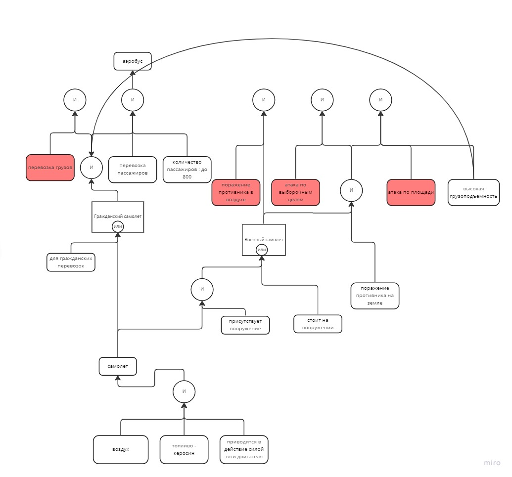

# Отчет по лабораторной работе
## по курсу "Искусственый интеллект"

### Студенты: 

| ФИО       | Роль в проекте                     | Оценка       |
|-----------|------------------------------------|--------------|
| Андреев Александр | реализация части ЭС, отвечающую за водные ТС, разработка системы на Python |          |
| Попов Илья | реализация части ЭС, отвечающую за воздушные ТС, оформление отчета |       |
| Семин Александр| реализация части ЭС, отвечающую за наземные ТС, разработка системы на Python |      |


> *Комментарии проверяющих (обратите внимание, что более подробные комментарии возможны непосредственно в репозитории по тексту программы)*

## Тема работы

Экспертная система по классификации транспортных средств

## Концептуализация предметной области

Предметная область была разбита на такие составляющие, как воздушный, наземный и водный транспорт. Составляющие были распределены между участниками.

Для реализации онтологии между этими составляющими были выделены такие параметры, как:
 - Цель применения (функция ТС)
 - Тип топлива
 - Особенности устройства
 - Экипаж
 - Количество пассажиров
 - Принцип движения (приводится ли в движение двигателем/реактивной тягой и т.д.)
 - Грузоподъемность
 - Водоизмещение
 - Вооружение
 - Масса
 - Права (какие требуются для управления ТС)
 - Пассажирские места (количество)

Реализованная система не изменяется во времени, вследствие чего динамические знания не требуются.

Для того, чтобы приложить графические иллюстрации используется ссылка на онлайн-доску Miro
https://miro.com/app/board/uXjVPgdF5Ak=/

## Принцип реализации системы

Система была реализована на языке программирования Python реализуя свою оболочку ЭС и синтаксис правил. Для выполнения цели работы - выдвижение гипотезы с последующим подтверждением ее фактами - использовался обратный порядок обхода.

## Механизм вывода

Механизм обратного вывода:
```python
class KnowledgeBase():
    def __init__(self,rules):
        self.rules = rules
        self.memory = {}
        
    def get(self,name):
        if name in self.memory.keys():
            return self.memory[name]
        for fld in self.rules.keys():
            if fld==name or fld.startswith(name+":"):
                value = 'y' if fld==name else fld.split(':')[1]
                res = self.eval(self.rules[fld],field=name)
                if res=='y':
                    self.memory[name] = value
                    return value
        res = self.eval(self.rules['default'],field=name)
        self.memory[name]=res
        return res
                
    def eval(self,expr,field=None):
        if isinstance(expr,Ask):
            print(field)
            return expr.ask()
        elif isinstance(expr,If):
            return self.eval(expr.x)
        elif isinstance(expr,AND) or isinstance(expr,list):
            expr = expr.x if isinstance(expr,AND) else expr
            for x in expr:
                if self.eval(x)=='n':
                    return 'n'
            return 'y'
        elif isinstance(expr,OR):
            for x in expr.x:
                if self.eval(x)=='y':
                    return 'y'
            return 'n'
        elif isinstance(expr,str):
            return self.get(expr)
        else:
            print("Unknown expr: {}".format(expr))
```


## Извлечение знаний и база знаний

Заполнение базы знаний происходило на основе ообщеизвестных фактов, с их нахождением в Интернете не возникло сложностей.

## Протокол работы системы

```bash
lunidep@DESKTOP-IO95C6F:~/github$ /bin/python3 /home/lunidep/github/lab2.py
Цель применения:атака по выборочным целям
y/n
y
Цель применения:поражение противника на земле
y/n
y
Тип топлива:Керосин
y/n
y
Зона действия:воздух
y/n
y
Принцип движения:приводится в действие силой тяги двигателя
y/n
y
Вооружение:Присутствует
y/n
y
Вооружение:Стоит
y/n
y
Штурмовик
```


```bash
lunidep@DESKTOP-IO95C6F:~/github$ /bin/python3 /home/lunidep/github/lab2.py
Цель применения:атака по выборочным целям
y/n
n
Цель применения:атака по площади
y/n
n
Цель применения:поражение противника в воздухе
y/n
n
Цель применения:Перевозка грузов
y/n
n
Цель применения:Перевозка пассажиров
y/n
y
Гражданские перевозки
y/n
n
Тип топлива:Керосин
y/n
y
Зона действия:воздух
y/n
y
Принцип движения:приводится в действие силой тяги двигателя
y/n
y
Грузоподъемность:Высокая
y/n
y
Количество пассажиров:до 800
y/n
y
Аэробус
```



## Выводы

Выполнив данную лабораторную работу, наша команда пришла к выводу, что экспертные системы не  могут обеспечить эффективный поиск результата исходя из несортированных фактов базы знаний. Наибольшую сложность представляло создание самой экспертной системы и оформление ее в понятном виде. Для иллюстрации экспертной системы и обеспечения большего взаимопонимания внутри команды использовалась онлайн-платформа для командной работы Miro.
